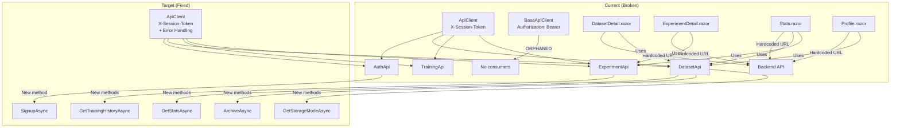

# TrainWise Frontend Remediation Plan

## Executive Summary

After thorough investigation of the entire TrainWise codebase, I've identified **15 distinct issues** across the frontend (Blazor WebAssembly) and backend (ASP.NET Core) that need to be fixed. These fall into four categories:

1. **API Client Architecture** — Dual client system with incompatible auth headers
2. **Missing Endpoints** — Frontend services not exposing available backend APIs
3. **Hardcoded URLs & Dynamic Types** — Pages bypassing service layer, using `dynamic` instead of typed models
4. **UI Clutter & Inconsistency** — Overlapping pages, mixed concerns, inconsistent styling patterns

---

## Issue Catalog

### 🔴 Critical (Blocks functionality)

| # | Issue | Files | Description |
|---|-------|-------|-------------|
| C1 | **Dual API clients with incompatible auth** | [`BaseApiClient.cs`](TrainWise.Web/Services/Api/BaseApiClient.cs:30) uses `Authorization: Bearer` header, but backend [`SessionTokenAuthenticationHandler.cs`](TrainWise.API/Services/Auth/SessionTokenAuthenticationHandler.cs:23) reads `X-Session-Token` header. Meanwhile [`ApiClient.cs`](TrainWise.Web/Services/Api/ApiClient.cs:17) correctly uses `X-Session-Token`. All 4 service classes (`AuthApi`, `DatasetApi`, `TrainingApi`, `ExperimentApi`) use the old `ApiClient`, while `BaseApiClient` is orphaned. | 
| C2 | **No signup endpoint** | Backend [`AuthController.cs`](TrainWise.API/Controllers/Auth/AuthController.cs:18) only has `POST /api/auth/login`. Frontend [`Signup.razor`](TrainWise.Web/Pages/Auth/Signup.razor:136) calls `LoginAsync()` as a workaround with comment "For now, attempt login with the new credentials". |
| C3 | **Hardcoded localhost URLs in pages** | [`DatasetDetail.razor`](TrainWise.Web/Pages/Datasets/DatasetDetail.razor:170) hardcodes `http://localhost:5000/api/dataset/{Id}/summary` and [`DatasetDetail.razor:202`](TrainWise.Web/Pages/Datasets/DatasetDetail.razor:202) hardcodes delete URL. [`ExperimentDetail.razor`](TrainWise.Web/Pages/Experiments/ExperimentDetail.razor:144) hardcodes `http://localhost:5000/api/experiments/{Id}`. [`Stats.razor`](TrainWise.Web/Pages/Stats.razor:149) hardcodes `http://localhost:5000/api/dataset/manage/stats`. [`Profile.razor`](TrainWise.Web/Pages/User/Profile.razor:137) hardcodes stats URL. [`CompareExperiments.razor`](TrainWise.Web/Pages/Experiments/CompareExperiments.razor:147) hardcodes training-history URL. |

### 🟡 High (Breaks features)

| # | Issue | Files | Description |
|---|-------|-------|-------------|
| H1 | **Missing API methods in frontend services** | [`DatasetApi.cs`](TrainWise.Web/Services/Api/DatasetApi.cs) is missing `GetStatsAsync()`, `ArchiveAsync()`, `GetStorageModeAsync()` — all available at backend [`DatasetManagementController.cs`](TrainWise.API/Controllers/Datasets/DatasetManagementController.cs). [`ExperimentApi.cs`](TrainWise.Web/Services/Api/ExperimentApi.cs) is missing `CompareAsync()`. |
| H2 | **Pages use `dynamic`/`ExpandoObject` instead of typed models** | [`Datasets.razor`](TrainWise.Web/Pages/Datasets/Datasets.razor:90) uses `List<dynamic>`. [`DatasetDetail.razor`](TrainWise.Web/Pages/Datasets/DatasetDetail.razor:146) uses `dynamic?`. [`ExperimentDetail.razor`](TrainWise.Web/Pages/Experiments/ExperimentDetail.razor:122) uses `dynamic?`. [`Stats.razor`](TrainWise.Web/Pages/Stats.razor:125) uses `dynamic?`. [`Profile.razor`](TrainWise.Web/Pages/User/Profile.razor:118) uses `dynamic?`. [`CompareExperiments.razor`](TrainWise.Web/Pages/Experiments/CompareExperiments.razor:121) uses `List<dynamic>`. [`Train.razor`](TrainWise.Web/Pages/Training/Train.razor:232) uses `List<dynamic>`. |
| H3 | **Auth header mismatch in pages using raw HttpClient** | [`DatasetDetail.razor`](TrainWise.Web/Pages/Datasets/DatasetDetail.razor:220) sends `Authorization: Bearer` but backend expects `X-Session-Token`. Same issue in [`ExperimentDetail.razor:186`](TrainWise.Web/Pages/Experiments/ExperimentDetail.razor:186), [`Stats.razor`](TrainWise.Web/Pages/Stats.razor), [`Profile.razor`](TrainWise.Web/Pages/User/Profile.razor:160), [`CompareExperiments.razor:189`](TrainWise.Web/Pages/Experiments/CompareExperiments.razor:189). |
| H4 | **Frontend model properties don't match backend DTOs** | [`DatasetSummary.cs`](TrainWise.Web/Models/DatasetSummary.cs) is missing `Columns`, `Preview`, `CorrelationMatrix`, `ClassDistribution`, `ImbalanceRatio` properties that [`DatasetDetail.razor`](TrainWise.Web/Pages/Datasets/DatasetDetail.razor:72) references. Backend [`DatasetSummaryDto.cs`](TrainWise.API/Contracts/Dataset/DatasetSummaryDto.cs) has `DatasetId` as string, frontend model has `DatasetId` as Guid. |

### 🟠 Medium (Degrades UX)

| # | Issue | Files | Description |
|---|-------|-------|-------------|
| M1 | **Upload.razor has mixed concerns** | [`Upload.razor`](TrainWise.Web/Pages/Datasets/Upload.razor) combines upload functionality AND a full dataset list table with delete/copy actions. Should be split into upload-focused page with redirect to datasets list. |
| M2 | **Summary.razor overlaps with DatasetDetail.razor** | [`Summary.razor`](TrainWise.Web/Pages/Datasets/Summary.razor) at `/datasets/{id}/summary` shows basic stats that are also shown in [`DatasetDetail.razor`](TrainWise.Web/Pages/Datasets/DatasetDetail.razor) at `/datasets/{id}`. Creates confusion about which page to use. |
| M3 | **Inconsistent styling patterns** | Some pages use `.panel`/`.panel-header` (Upload, Summary, Configure, Metrics, Recommendations) while others use `.page-header`/`.detail-grid` (Datasets, DatasetDetail, ExperimentDetail, Stats). Mixed CSS class conventions. |
| M4 | **Metrics.razor and Recommendations.razor are placeholder pages** | [`Metrics.razor`](TrainWise.Web/Pages/Results/Metrics.razor) and [`Recommendations.razor`](TrainWise.Web/Pages/Results/Recommendations.razor) show static placeholder text with no actual data loading. |
| M5 | **Configure.razor is a static form with no backend integration** | [`Configure.razor`](TrainWise.Web/Pages/Training/Configure.razor) has form fields but no code-behind, no API calls, no state management. |

### 🔵 Low (Polish)

| # | Issue | Files | Description |
|---|-------|-------|-------------|
| L1 | **ExperimentDetail.razor calls wrong API path** | Line 144 calls `http://localhost:5000/api/experiments/{Id}` (plural) but backend [`ExperimentController.cs`](TrainWise.API/Controllers/Experiments/ExperimentController.cs) route is `api/experiment` (singular). |
| L2 | **CompareExperiments.razor comparison logic is incomplete** | [`CompareExperiments.razor:156`](TrainWise.Web/Pages/Experiments/CompareExperiments.razor:156) has comment "Add parsing logic here" with empty experiments list. The `CompareAsync()` method at line 182 just calls `OnExperimentSelected()` without any actual comparison computation. |
| L3 | **Stats.razor training history parsing is incomplete** | [`Stats.razor:164`](TrainWise.Web/Pages/Stats.razor:164) has comment "Parse and populate" with empty implementation. |

---

## Remediation Plan

### Phase 1: API Layer Fixes (Backend + Frontend Services)

#### Task 1.1: Add signup endpoint to backend
- **Files to modify:**
  - [`IAuthService.cs`](TrainWise.API/Services/Auth/IAuthService.cs) — Add `SignupAsync(SignupRequest, CancellationToken)` method signature
  - [`AuthService.cs`](TrainWise.API/Services/Auth/AuthService.cs) — Implement `SignupAsync` that creates a new User in DB, returns LoginResponse with session token
  - [`AuthController.cs`](TrainWise.API/Controllers/Auth/AuthController.cs) — Add `POST /api/auth/signup` endpoint
  - [`Contracts/Auth/`](TrainWise.API/Contracts/Auth/) — Create `SignupRequest.cs` (Username, Password)
- **Backend endpoint:** `POST /api/auth/signup` with body `{ username, password }`
- **Response:** Same as login — `{ sessionToken, userId }`

#### Task 1.2: Consolidate API client system
- **Files to modify:**
  - [`ApiClient.cs`](TrainWise.Web/Services/Api/ApiClient.cs) — Merge error handling, logging, and 401 handling from `BaseApiClient.cs` into `ApiClient.cs`. Keep `X-Session-Token` header (matches backend).
  - [`BaseApiClient.cs`](TrainWise.Web/Services/Api/BaseApiClient.cs) — **Delete** this file (or keep as deprecated with clear comment). All services use `ApiClient`.
- **Key decision:** Keep `X-Session-Token` approach since backend authentication handler reads this header. Do NOT switch to Bearer.

#### Task 1.3: Add missing API methods to frontend services
- **Files to modify:**
  - [`AuthApi.cs`](TrainWise.Web/Services/Api/AuthApi.cs) — Add `SignupAsync(string username, string password)` method calling `POST api/auth/signup`
  - [`DatasetApi.cs`](TrainWise.Web/Services/Api/DatasetApi.cs) — Add:
    - `GetStatsAsync()` → `GET api/dataset/manage/stats`
    - `ArchiveAsync(int daysOld = 30)` → `POST api/dataset/manage/archive?daysOld={daysOld}`
    - `GetStorageModeAsync()` → `GET api/dataset/manage/storage-mode`
    - Remove `GetDatasetsAsync()` (returns `List<dynamic>`) — replace usage with `GetAllAsync()` (returns typed `DatasetList`)
    - Remove `GetDatasetSummaryAsync(string)` (redundant wrapper)
    - Remove `DeleteDatasetAsync(Guid)` (redundant wrapper)
  - [`ExperimentApi.cs`](TrainWise.Web/Services/Api/ExperimentApi.cs) — Add:
    - `GetTrainingHistoryAsync()` → `GET api/dataset/manage/training-history`
  - [`TrainingApi.cs`](TrainWise.Web/Services/Api/TrainingApi.cs) — No changes needed (already has `TrainAsync`)

#### Task 1.4: Update frontend models to match backend DTOs
- **Files to modify:**
  - [`DatasetSummary.cs`](TrainWise.Web/Models/DatasetSummary.cs) — Add missing properties:
    - `List<string> Columns` (column names)
    - `List<List<string>> Preview` (data preview rows)
    - `List<List<double>> CorrelationMatrix`
    - `Dictionary<string, int>? ClassDistribution`
    - `double? ImbalanceRatio`
    - Change `DatasetId` from `Guid` to `string` to match backend DTO
  - [`DatasetList.cs`](TrainWise.Web/Models/DatasetList.cs) — Add `DatasetName` property to `DatasetListItem` (mapped from `FileName` in backend)
  - [`ExperimentDetail.cs`](TrainWise.Web/Models/ExperimentDetail.cs) — Add properties:
    - `string DatasetName`
    - `Dictionary<string, string> HyperParameters` (deserialized from `HyperparametersJson`)
    - `ClassificationMetrics? Metrics` (deserialized from `MetricsJson`)
    - `double? TrainingDurationSec`
  - [`ExperimentList.cs`](TrainWise.Web/Models/ExperimentList.cs) — Add `int Page`, `int PageSize`, `int TotalCount` to match backend `ExperimentListDto`

### Phase 2: Page Refactoring (Frontend)

#### Task 2.1: Fix DatasetDetail.razor
- **Files to modify:** [`DatasetDetail.razor`](TrainWise.Web/Pages/Datasets/DatasetDetail.razor)
- **Changes:**
  - Remove `@inject HttpClient` — use injected `DatasetApi` and `ExperimentApi` services instead
  - Remove `AddAuthHeader()` method — services handle auth
  - Replace `dynamic? _dataset` with typed `DatasetSummary? _summary`
  - Replace `dynamic? _summary` with typed model
  - Replace `List<dynamic>? _relatedExperiments` with `List<ExperimentListItem>?`
  - Replace hardcoded URLs with service calls:
    - `DatasetApi.GetSummaryAsync(Guid.Parse(Id))` for dataset summary
    - `ExperimentApi.GetHistoryAsync()` filtered by dataset
  - Fix property references: `_dataset.Name` → `_summary.FileName` (or add `Name` property), `_dataset.CreatedAt` → use `UploadedAt` from list or summary
  - Fix `_summary.Columns` → use `_summary.ColumnTypes.Keys.ToList()`
  - Fix `_summary.Preview` → this needs to come from a new endpoint or be added to summary DTO

#### Task 2.2: Fix Datasets.razor
- **Files to modify:** [`Datasets.razor`](TrainWise.Web/Pages/Datasets/Datasets.razor)
- **Changes:**
  - Replace `List<dynamic> _datasets` with `List<DatasetListItem> _datasets`
  - Replace `List<dynamic> _filteredDatasets` with `List<DatasetListItem>`
  - Replace `List<dynamic> _paginatedDatasets` with `List<DatasetListItem>`
  - Update `LoadDatasets()` to use `DatasetApi.GetAllAsync()` directly (not `GetDatasetsAsync()` which returns dynamic)
  - Remove `dynamic` casts in `OnFilterApplied()`
  - Add `DatasetName` property to `DatasetListItem` model (mapped from `FileName`)

#### Task 2.3: Fix ExperimentDetail.razor
- **Files to modify:** [`ExperimentDetail.razor`](TrainWise.Web/Pages/Experiments/ExperimentDetail.razor)
- **Changes:**
  - Remove `@inject HttpClient` — use injected `ExperimentApi` service
  - Remove `AddAuthHeader()` method
  - Replace `dynamic? _experiment` with typed `ExperimentDetail?`
  - Replace hardcoded URL with `ExperimentApi.GetAsync(Guid.Parse(Id))`
  - Fix API path: `api/experiments/{Id}` → `api/experiment/{Id}` (singular)
  - Remove export endpoint call (`/api/experiments/{Id}/export` doesn't exist on backend)

#### Task 2.4: Fix Stats.razor (Dashboard)
- **Files to modify:** [`Stats.razor`](TrainWise.Web/Pages/Stats.razor)
- **Changes:**
  - Remove `@inject HttpClient` — use injected `DatasetApi` and `ExperimentApi`
  - Remove `AddAuthHeader()` method
  - Replace `dynamic? _stats` with a new typed `DashboardStats` model
  - Replace `List<dynamic>? _trainingHistory` with `List<ExperimentListItem>?`
  - Replace hardcoded URLs with service calls:
    - `DatasetApi.GetStatsAsync()` for stats
    - `ExperimentApi.GetTrainingHistoryAsync()` for training history
  - Implement the "Parse and populate" logic for training history

#### Task 2.5: Fix Profile.razor
- **Files to modify:** [`Profile.razor`](TrainWise.Web/Pages/User/Profile.razor)
- **Changes:**
  - Remove `@inject HttpClient` — use injected `DatasetApi`
  - Remove `AddAuthHeader()` method
  - Replace `dynamic? _stats` with typed `DashboardStats` model
  - Replace hardcoded URL with `DatasetApi.GetStatsAsync()`

#### Task 2.6: Fix CompareExperiments.razor
- **Files to modify:** [`CompareExperiments.razor`](TrainWise.Web/Pages/Experiments/CompareExperiments.razor)
- **Changes:**
  - Remove `@inject HttpClient` — use injected `ExperimentApi`
  - Remove `AddAuthHeader()` method
  - Replace `List<dynamic>? _experiments` with `List<ExperimentListItem>?`
  - Replace `dynamic? _experiment1`, `_experiment2`, `_comparison` with typed models
  - Replace hardcoded URL with `ExperimentApi.GetTrainingHistoryAsync()`
  - Implement actual comparison logic in `CompareAsync()` (compare metrics between two experiments)
  - Remove empty "Add parsing logic here" comment

#### Task 2.7: Fix Signup.razor
- **Files to modify:** [`Signup.razor`](TrainWise.Web/Pages/Auth/Signup.razor)
- **Changes:**
  - Replace `AuthApi.LoginAsync()` call with new `AuthApi.SignupAsync()` method
  - Update success/error messaging for signup-specific responses

#### Task 2.8: Fix Train.razor
- **Files to modify:** [`Train.razor`](TrainWise.Web/Pages/Training/Train.razor)
- **Changes:**
  - Replace `List<dynamic>? _datasets` with `List<DatasetListItem>?`
  - Replace `dynamic? _selectedDataset` with `DatasetListItem?`
  - Remove `dynamic` casts in dataset selection
  - Update `LoadDatasets()` to use `DatasetApi.GetAllAsync()` instead of `GetDatasetsAsync()`

### Phase 3: UI Cleanup

#### Task 3.1: Clean up Upload.razor
- **Files to modify:** [`Upload.razor`](TrainWise.Web/Pages/Datasets/Upload.razor)
- **Changes:**
  - Remove the dataset list table (lines 50-94) — this duplicates `Datasets.razor`
  - After successful upload, show success message with link to `/datasets` instead of full table
  - Remove `LoadDatasetsAsync()`, `CopyIdAsync()`, `DeleteAsync()` methods (they belong on Datasets page)
  - Simplify to focus on upload-only workflow

#### Task 3.2: Consolidate Summary.razor into DatasetDetail.razor
- **Files to modify:** 
  - [`Summary.razor`](TrainWise.Web/Pages/Datasets/Summary.razor) — Either remove or redirect to DatasetDetail
  - [`DatasetDetail.razor`](TrainWise.Web/Pages/Datasets/DatasetDetail.razor) — Ensure it shows all summary info (column types, stats)
- **Decision:** Remove `Summary.razor` page and its route `/datasets/{id}/summary`. The detail page at `/datasets/{id}` already shows all this info.

#### Task 3.3: Implement Metrics.razor and Recommendations.razor
- **Files to modify:**
  - [`Metrics.razor`](TrainWise.Web/Pages/Results/Metrics.razor) — Load and display actual metrics from `ExperimentApi.GetAsync()`
  - [`Recommendations.razor`](TrainWise.Web/Pages/Results/Recommendations.razor) — Load and display recommendations from training result
- **Changes:** Replace placeholder text with actual data loading and rendering

#### Task 3.4: Standardize styling patterns
- **Files to modify:** All pages
- **Changes:** 
  - Audit all pages for consistent use of `.page-header` pattern (preferred) vs `.panel` pattern
  - Standardize on `.page-header` for top-level pages, `.panel` only for embedded/card sections
  - Move `<style>` blocks to shared CSS files where possible

### Phase 4: New Models & Types

#### Task 4.1: Create DashboardStats model
- **New file:** [`TrainWise.Web/Models/DashboardStats.cs`](TrainWise.Web/Models/)
- **Properties:**
  - `int TotalDatasets`
  - `int ActiveDatasets`
  - `int TotalExperiments`
  - `string EstimatedSize` (formatted string)
  - `string StorageMode`

#### Task 4.2: Create ExperimentCompareResult model
- **New file:** [`TrainWise.Web/Models/ExperimentCompareResult.cs`](TrainWise.Web/Models/)
- **Properties:**
  - `ExperimentDetail Experiment1`
  - `ExperimentDetail Experiment2`
  - `Dictionary<string, ComparisonRow> Comparisons`

---

## Architecture Diagram

---

## Execution Order

The tasks are ordered by dependency — later tasks depend on earlier ones being completed:

| Step | Task | Depends On | Files Changed |
|------|------|------------|---------------|
| 1 | Add signup endpoint (backend) | None | 4 files (IAuthService, AuthService, AuthController, SignupRequest) |
| 2 | Consolidate API clients | None | 2 files (ApiClient.cs modified, BaseApiClient.cs deleted) |
| 3 | Add missing API methods | Step 2 | 3 files (AuthApi, DatasetApi, ExperimentApi) |
| 4 | Update frontend models | None | 5 files (DatasetSummary, DatasetList, ExperimentDetail, ExperimentList, +2 new) |
| 5 | Fix DatasetDetail.razor | Steps 2, 3, 4 | 1 file |
| 6 | Fix Datasets.razor | Steps 2, 4 | 1 file |
| 7 | Fix ExperimentDetail.razor | Steps 2, 3, 4 | 1 file |
| 8 | Fix Stats.razor | Steps 2, 3, 4 | 1 file |
| 9 | Fix Profile.razor | Steps 2, 3, 4 | 1 file |
| 10 | Fix CompareExperiments.razor | Steps 2, 3, 4 | 1 file |
| 11 | Fix Signup.razor | Steps 1, 3 | 1 file |
| 12 | Fix Train.razor | Steps 2, 4 | 1 file |
| 13 | Clean up Upload.razor | Step 6 | 1 file |
| 14 | Consolidate Summary.razor | Step 5 | 2 files (Summary.razor removed, DatasetDetail updated) |
| 15 | Implement Metrics + Recommendations | Steps 3, 4 | 2 files |
| 16 | Standardize styling | All above | All pages |

---

## Risk Assessment

| Risk | Impact | Likelihood | Mitigation |
|------|--------|------------|------------|
| Breaking existing auth flow | High | Low | Keep `X-Session-Token` header — only merge error handling from BaseApiClient |
| Model property mismatches breaking pages | High | Medium | Carefully map all backend DTO properties to frontend models before changing pages |
| Removing `GetDatasetsAsync()` (returns dynamic) breaks Train.razor | High | Low | Update Train.razor in same PR to use typed `GetAllAsync()` |
| Signup endpoint conflicts with existing login flow | Medium | Low | Signup creates user + returns session token; login remains unchanged |
| CSS standardization breaks layout | Low | Medium | Use find-and-replace for class names, verify each page renders correctly |
