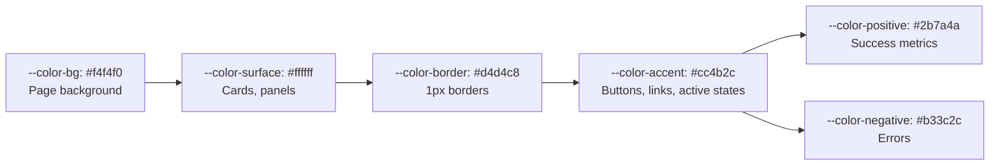

# TrainWise UI Redesign Plan

## 1. Aesthetic Direction: **Swiss / International Style**

This is a machine learning training platform — data-heavy, analytical, and tool-oriented. **Swiss / International Style** offers:
- **Typographic clarity** —排版 communicates hierarchy, not decorative elements
- **Structural grid** — data tables, metrics, and experiment cards benefit from rigorous alignment
- **Minimal ornament** — no gradients, no blur effects, no decorative circles
- **Color used sparingly** — reserved for data visualization and functional feedback
- **High information density** — appropriate for a data science tool

---

## 2. Seven Mandatory Design Decisions

### 2.1 Font Pairing

| Role | Font | Reason |
|------|------|--------|
| **UI / Body** | [`DM Sans`](https://fonts.google.com/specimen/DM+Sans) — 400, 500, 700 | Clean geometric sans with warmth; not banned (not Inter/Roboto/Poppins). Excellent legibility at small sizes (11–14px) used throughout the app. |
| **Display / Data** | [`DM Mono`](https://fonts.google.com/specimen/DM+Mono) — 400, 500 | Monospace for data values, metrics, code snippets, hyperparameters. Pairs perfectly with DM Sans (same foundry, same x-height). |

Banned fonts avoided: Inter, Roboto, Poppins, JetBrains Mono, Fira Code.

### 2.2 Color Palette

No teal (`#0f766e` — currently used and banned), no indigo, no purple.

```css
:root {
  --color-bg:           #f4f4f0;      /* Warm off-white paper */
  --color-surface:      #ffffff;      /* Card/sheet backgrounds */
  --color-surface-raised:#fafaf8;     /* Subtle hover state */
  --color-border:       #d4d4c8;      /* Soft pencil-line borders */
  --color-border-strong:#a8a898;      /* Stronger border for tables */
  --color-text:         #1a1a14;      /* Near-black with warmth */
  --color-text-secondary:#707060;     /* Muted text */
  --color-accent:       #cc4b2c;      /* Burnt orange/terracotta — single accent */
  --color-accent-hover: #a83d23;      /* Darker accent */
  --color-positive:     #2b7a4a;      /* Green for metrics/accuracy */
  --color-negative:     #b33c2c;      /* Red for errors/destructive */
  --color-warning:      #b8860b;      /* Dark gold for warnings */
}
```

**Rule:** `--color-accent` is the ONLY color used for interactive elements (buttons, links, focus states). No secondary accent color.

### 2.3 Grid System

Use a **strict 8px baseline grid** for all spacing, padding, and sizing. No fractional values.

- Container `max-width: 1200px` (wider than current 1100px — data needs room)
- Base unit: `8px`
- Spacing scale: 4, 8, 12, 16, 24, 32, 48, 64, 96

Two layout primitives:
- **`.page`** — `display: flex; flex-direction: column; gap: 24px;`
- **`.grid`** — `display: grid; grid-template-columns: repeat(var(--cols, 12), 1fr); gap: 16px;`

### 2.4 Signature Detail

**Underlined active nav state with a single 2px solid rule matching the accent color.** No rounded pills, no gradient backgrounds for active states. The active page is marked by a thin, typographic underline — a hallmark of Swiss design.

Additionally, all cards and panels use **sharp corners** (`border-radius: 0`). The only radius allowed is on buttons (`border-radius: 4px`).

### 2.5 Motion Philosophy

**No decorative animations.** Zero. No fade-in-up, no hover lift, no scale transforms, no staggered reveals.

Only functional motion:
- **Button hover:** immediate background color swap (no transition)
- **Loading spinner:** CSS-only, reduced size (20px), neutral gray
- **Modal/dropdown:** instant show/hide (no opacity transitions)

**Banned patterns eliminated:** `hover:scale-105`, `fade-in-up`, `translateY`, `backdrop-filter`, `transition: all`.

### 2.6 Spacing System

| Token | Value | Usage |
|-------|-------|-------|
| `--space-1` | 4px | Tight icon/text gap |
| `--space-2` | 8px | Button padding, card internal gap |
| `--space-3` | 12px | Element spacing |
| `--space-4` | 16px | Grid gap, section padding |
| `--space-5` | 24px | Page section margin |
| `--space-6` | 32px | Page header from content |
| `--space-7` | 48px | Major section break |
| `--space-8` | 64px | Page top padding |

### 2.7 Component Personality

| Component | Personality |
|-----------|-------------|
| **Buttons** | Flat, rectangular, no border-radius (except 4px). Solid accent fill for primary; outlined (1px border, no fill) for secondary/ghost. |
| **Cards** | Sharp corners, 1px border, no shadow (use `--color-border`). White `--color-surface` background. |
| **Tables** | Full-width, border-collapse, horizontal rules only (no vertical lines). Striped rows optional (every other row gets `--color-surface-raised`). |
| **Forms** | Inputs: no border-radius, border-bottom only (material-style underline). Focus: 2px accent underline. Labels: uppercase, 11px, letter-spacing 0.5px. |
| **Navigation** | Horizontal text links (no icon pills). Active page: 2px underline in accent color. No user avatar circle — username rendered as text only. |
| **Tags/Badges** | All-caps, 10px, letter-spacing 1px, border-only (no background fill). |
| **Empty/Loading states** | No illustration or large icon. Simple text: "No datasets found." Loading: 16px spinner. |
| **Charts** | SVG-based rendering (replace HTML table-based charts). Simplified color encoding using accent + positive + negative only. |

---

## 3. Complete File Inventory

Every file listed below needs CSS overhaul. Files marked **(razor)** also need HTML/markup changes.

### 3.1 Global Stylesheet (Rewrite)

| File | Action |
|------|--------|
| [`wwwroot/css/site.css`](../TrainWise.Web/wwwroot/css/site.css) | **Rewrite completely** — new variables, reset, typography, grid, buttons, forms, tables. Remove all existing decorative styles. |

### 3.2 Layout & Navigation

| File | Action |
|------|--------|
| [`Components/Layout/MainLayout.razor`](../TrainWise.Web/Components/Layout/MainLayout.razor) | Rewrite footer (remove decorative border, align to grid). Scoped styles. |
| [`Components/Navigation/TopNav.razor`](../TrainWise.Web/Components/Navigation/TopNav.razor) | **Major markup + style rewrite** — remove avatar circle, remove icon pills, use text-only links with underline active state, remove gradient brand mark, remove blur/backdrop. |

### 3.3 Auth Pages

| File | Action |
|------|--------|
| [`Pages/Auth/Login.razor`](../TrainWise.Web/Pages/Auth/Login.razor) | Rewrite styles. Remove gradient brand mark, remove rounded panel, use form-underline inputs. Keep demo section functional. |
| [`Pages/Auth/Signup.razor`](../TrainWise.Web/Pages/Auth/Signup.razor) | Same as Login. |

### 3.4 Landing Page

| File | Action |
|------|--------|
| [`Pages/Index.razor`](../TrainWise.Web/Pages/Index.razor) | **Complete rewrite** — remove hero section pattern, remove gradient text, remove feature cards with hover lift. Replace with simple grid of feature items, no min-height, no gradient background. |

### 3.5 Datasets Pages

| File | Action |
|------|--------|
| [`Pages/Datasets/Datasets.razor`](../TrainWise.Web/Pages/Datasets/Datasets.razor) | Rewrite scoped styles. Remove card gradient headers, remove hover:translateY, remove rounded corners on cards. Replace with flat bordered cells. |
| [`Pages/Datasets/DatasetDetail.razor`](../TrainWise.Web/Pages/Datasets/DatasetDetail.razor) | Rewrite styles. Remove gradient backgrounds from metric items, remove rounded containers, use flat grid layout. |
| [`Pages/Datasets/Upload.razor`](../TrainWise.Web/Pages/Datasets/Upload.razor) | Rewrite upload dropzone (remove dashed border, use solid 1px border). Simplify file info display. |

### 3.6 Training Pages

| File | Action |
|------|--------|
| [`Pages/Training/Train.razor`](../TrainWise.Web/Pages/Training/Train.razor) | Rewrite form styles. Remove success card gradient. Simplify form layout. |
| [`Pages/Training/Configure.razor`](../TrainWise.Web/Pages/Training/Configure.razor) | Minor style update. |

### 3.7 Experiments Pages

| File | Action |
|------|--------|
| [`Pages/Experiments/History.razor`](../TrainWise.Web/Pages/Experiments/History.razor) | Rewrite card grid. Remove gradient headers, rounded corners, hover lift. Use flat bordered cards. |
| [`Pages/Experiments/ExperimentDetail.razor`](../TrainWise.Web/Pages/Experiments/ExperimentDetail.razor) | Rewrite styles. Remove gradient metric items, simplify badge styles. |
| [`Pages/Experiments/CompareExperiments.razor`](../TrainWise.Web/Pages/Experiments/CompareExperiments.razor) | Rewrite comparison table styles with clean bordered cells. |

### 3.8 Results Pages

| File | Action |
|------|--------|
| [`Pages/Results/Metrics.razor`](../TrainWise.Web/Pages/Results/Metrics.razor) | Rewrite metric cards (remove emoji icons, use text labels). Style confusion matrix, classification report table. |
| [`Pages/Results/Recommendations.razor`](../TrainWise.Web/Pages/Results/Recommendations.razor) | Rewrite recommendation cards. Remove severity badge fills (use border-only). |

### 3.9 User Pages

| File | Action |
|------|--------|
| [`Pages/User/Profile.razor`](../TrainWise.Web/Pages/User/Profile.razor) | Rewrite profile card (remove avatar circle — use text initial in a bordered square). Remove rounded containers. |
| [`Pages/User/Settings.razor`](../TrainWise.Web/Pages/User/Settings.razor) | Rewrite settings nav and content. Remove sidebar icon pills, use text-only tabs with underline active state. |

### 3.10 Dashboard

| File | Action |
|------|--------|
| [`Pages/Stats.razor`](../TrainWise.Web/Pages/Stats.razor) | Rewrite stat cards (remove emoji icons, remove rounded corners, use minimal bordered stat blocks). |

### 3.11 Common Components

| File | Action |
|------|--------|
| [`Components/Common/Breadcrumbs.razor`](../TrainWise.Web/Components/Common/Breadcrumbs.razor) | **Remove breadcrumbs** — banned pattern. Replace with simple page title + back link where needed. Or keep as minimal "Parent > Child" text without decorative separators. |
| [`Components/Common/FilterBar.razor`](../TrainWise.Web/Components/Common/FilterBar.razor) | Rewrite styles — remove rounded select, use underline-style filter dropdowns. |
| [`Components/Common/Pagination.razor`](../TrainWise.Web/Components/Common/Pagination.razor) | Rewrite — remove rounded active page, use bordered squares. |
| [`Components/Common/FormFeedback.razor`](../TrainWise.Web/Components/Common/FormFeedback.razor) | Minor style update. |
| [`Components/Common/StorageVisualization.razor`](../TrainWise.Web/Components/Common/StorageVisualization.razor) | Rewrite — use flat bordered bars instead of rounded. |
| [`Components/Common/CommonTypes.cs`](../TrainWise.Web/Components/Common/CommonTypes.cs) | No CSS changes needed (C# code). |
| [`Components/Shared/WizardStep.razor`](../TrainWise.Web/Components/Shared/WizardStep.razor) | Rewrite — use bordered step indicators, remove rounded pills. |

### 3.12 Chart Components

| File | Action |
|------|--------|
| [`Components/Charts/AccuracyBar.razor`](../TrainWise.Web/Components/Charts/AccuracyBar.razor) | Rewrite — remove rounded bars, use flat filled bars. Color: accent. |
| [`Components/Charts/ConfusionMatrix.razor`](../TrainWise.Web/Components/Charts/ConfusionMatrix.razor) | Rewrite — use flat cells with text-only values, no background opacity gradients. |
| [`Components/Charts/CorrelationHeatmap.razor`](../TrainWise.Web/Components/Charts/CorrelationHeatmap.razor) | Rewrite — use a flat 3-color scale (positive, neutral, negative). Remove rounded cells. |
| [`Components/Charts/FeatureImportance.razor`](../TrainWise.Web/Components/Charts/FeatureImportance.razor) | Rewrite — horizontal bar chart with flat filled bars. |

### 3.13 Build & Cleanup

| File | Action |
|------|--------|
| `TrainWise.Web.csproj` | No changes needed. |
| [`Services/Api/AuthApi.cs`](../TrainWise.Web/Services/Api/AuthApi.cs) | Clean up diagnostic `Console.WriteLine` statements. |
| [`Services/State/SessionState.cs`](../TrainWise.Web/Services/State/SessionState.cs) | Clean up diagnostic `Console.WriteLine` statements. |
| [`Components/Navigation/TopNav.razor`](../TrainWise.Web/Components/Navigation/TopNav.razor) | Remove diagnostic `Console.WriteLine` at top. |
| [`Services/Api/ApiClient.cs`](../TrainWise.Web/Services/Api/ApiClient.cs) | **Keep** the `PropertyNameCaseInsensitive = true` fix — this is the critical JSON fix. |

---

## 4. Page-by-Page Redesign Specification

### 4.1 Landing Page (`/`)

**Current problems:** Hero section (banned pattern), gradient text, feature cards with hover lift, full-viewport min-height.

**New design:**
```
┌─────────────────────────────────────┐
│                                     │
│   TrainWise                         │  ← h1, normal weight, accent color
│   Build powerful ML models          │  ← subtitle, text-secondary
│   without the complexity            │
│                                     │
│   [Sign In] [Create Account]        │  ← flat buttons, no rounding
│                                     │
│   ─── Features ───                  │  ← section label, uppercase, small
│                                     │
│   Smart Datasets    ML Training     │  ← 3-column grid
│   Upload, explore…  Configure…      │  ← flat bordered cells
│                                     │
│   Experiment Tracking               │
│   Compare experiments…              │
└─────────────────────────────────────┘
```

### 4.2 Login Page (`/login`)

**Current problems:** Gradient brand mark, rounded panel, rounded inputs.

**New design:**
```
┌─────────────────────────┐
│  TrainWise              │  ← text only, no mark
│  Sign in to continue    │
│                         │
│  USERNAME               │  ← underline label, uppercase
│  ─────────────────────  │  ← border-bottom input
│                         │
│  PASSWORD               │
│  ─────────────────────  │
│                         │
│  [SIGN IN]              │  ← flat accent button, full width
│                         │
│  ─────────────────────  │
│  Don't have an account? │
│  Create one             │
└─────────────────────────┘
```

### 4.3 Datasets List (`/datasets`)

**Current problems:** Card gradient headers, hover lift, emoji icons, rounded corners.

**New design:**
```
┌─────────────────────────────────────────┐
│  Datasets               [Upload Dataset]│  ← page header
│  Manage your training datasets          │
├─────────────────────────────────────────┤
│  ┌──────────┐ ┌──────────┐ ┌──────────┐│
│  │data.csv  │ │train.xlsx│ │test.csv  ││  ← flat bordered cards
│  │Mar 12    │ │Mar 10    │ │Mar 05    ││
│  │          │ │          │ │          ││
│  │Rows:1500 │ │Rows:3200 │ │Rows:800  ││
│  │Cols:12   │ │Cols:8    │ │Cols:15   ││
│  │          │ │          │ │          ││
│  │[View]    │ │[View]    │ │[View]    ││  ← flat buttons
│  │[Train]   │ │[Train]   │ │[Train]   ││
│  └──────────┘ └──────────┘ └──────────┘│
│  ← 1  2  3  4 ... →                    │  ← pagination, bordered squares
└─────────────────────────────────────────┘
```

### 4.4 Training Form (`/training`)

**Current problems:** Rounded selects, success card with gradient, emoji icons.

**New design:**
```
┌─────────────────────┬─────────────────┐
│  Train Model        │  Training Tips  │  ← two-column layout
│                     │  • Dataset:...  │
│  ─── Select Dataset──│  • Task Type:.. │
│  Dataset [______▼]  │  • Target:...   │
│                     │                 │
│  ─── Model Config ──│                 │
│  Task [_______▼]    │                 │
│  Model [_______▼]   │                 │
│  Target [______▼]   │                 │
│                     │                 │
│  ─── Advanced ──────│                 │
│  Split [70/30]      │                 │
│  CV [Disabled]      │                 │
│                     │                 │
│  [START TRAINING]   │                 │
│  [View History]     │                 │
└─────────────────────┴─────────────────┘
```

### 4.5 Experiment History (`/experiments`)

**Current problems:** Gradient card headers, hover lift, rounded corners, emoji icons.

**New design:**
```
┌─────────────────────────────────────────┐
│  History                 [New Training] │
│  Review all experiment runs             │
├─────────────────────────────────────────┤
│  ┌─────────────────────────────────────┐│
│  │ CLASSIFICATION  Mar 12, 2026        ││  ← bordered tag, date
│  │ Random Forest Classifier            ││  ← model name, bold
│  │ Dataset: data.csv                   ││
│  │ Metrics: Acc 94.2% | F1 0.93       ││
│  │ [Details] [Compare]                 ││
│  └─────────────────────────────────────┘│
│  ┌─────────────────────────────────────┐│
│  │ REGRESSION     Mar 10, 2026         ││
│  │ Linear Regression                   ││
│  │ Dataset: train.xlsx                 ││
│  │ Metrics: RMSE 1.24 | R² 0.87       ││
│  │ [Details] [Compare]                 ││
│  └─────────────────────────────────────┘│
└─────────────────────────────────────────┘
```

### 4.6 Dashboard (`/stats`)

**Current problems:** Emoji icons in stat cards, rounded corners, hover shadow.

**New design:**
```
┌─────────────────────────────────────────┐
│  Dashboard                              │
│  Overview of your ML workspace          │
├─────────────────────────────────────────┤
│  ┌─────────┐ ┌─────────┐ ┌─────────┐  │
│  │DATASETS │ │ACTIVE   │ │EXPERIMNT│  │  ← bordered stat blocks
│  │    12   │ │    9    │ │    47   │  │  ← large number, bold
│  └─────────┘ └─────────┘ └─────────┘  │
│                                        │
│  ─── Quick Actions ───                 │
│  ┌────────────────────────────────────┐│
│  │ Dataset Management                 ││  ← flat action cards
│  │ Manage your datasets...            ││
│  │ [View Datasets] [Archive Old]      ││
│  └────────────────────────────────────┘│
│                                        │
│  ─── Recent Training Runs ───          │
│  RF Classifier    94.2% acc  Mar 12   │  ← simple list rows
│  Linear Regressor  RMSE 1.24 Mar 10   │
│  SVM Classifier   88.5% acc  Mar 08   │
└─────────────────────────────────────────┘
```

---

## 5. Implementation Order

The implementation should proceed in this order, with each step building on the previous:

### Phase 1: Foundation (CSS + Layout)
1. **Rewrite `site.css`** — new CSS variables, reset, typography, grid system, form elements, buttons, tables
2. **Rewrite `MainLayout.razor`** — new footer, cleanup
3. **Rewrite `TopNav.razor`** — text-only nav, underline active state, no avatar circle

### Phase 2: Auth Pages
4. **Rewrite `Login.razor`** — flat forms, underline inputs, no decorative elements
5. **Rewrite `Signup.razor`** — same pattern as login

### Phase 3: Landing Page
6. **Rewrite `Index.razor`** — remove hero section, simple grid layout

### Phase 4: Dataset Pages
7. **Rewrite `Datasets.razor`** — flat grid cards, new pagination
8. **Rewrite `Upload.razor`** — flat dropzone
9. **Rewrite `DatasetDetail.razor`** — flat data displays

### Phase 5: Training
10. **Rewrite `Train.razor`** — flat form panels
11. **Update `Configure.razor`** — minor style changes

### Phase 6: Experiments
12. **Rewrite `History.razor`** — flat experiment cards
13. **Rewrite `ExperimentDetail.razor`** — flat metric displays
14. **Rewrite `CompareExperiments.razor`** — bordered comparison table

### Phase 7: Results
15. **Rewrite `Metrics.razor`** — text-based metric overview, styled chart containers
16. **Rewrite `Recommendations.razor`** — border-only severity badges

### Phase 8: User Pages
17. **Rewrite `Profile.razor`** — bordered avatar square, flat info rows
18. **Rewrite `Settings.razor`** — text-only tabs with underline active state

### Phase 9: Dashboard
19. **Rewrite `Stats.razor`** — bordered stat blocks, no emoji icons

### Phase 10: Common Components
20. **Rewrite `Pagination.razor`** — bordered squares
21. **Rewrite `FilterBar.razor`** — underline dropdowns
22. **Rewrite `Breadcrumbs.razor`** — minimal parent > child text
23. **Rewrite `StorageVisualization.razor`** — flat bars
24. **Rewrite `WizardStep.razor`** — bordered step indicators

### Phase 11: Charts
25. **Rewrite `AccuracyBar.razor`** — flat filled bars
26. **Rewrite `ConfusionMatrix.razor`** — flat cells
27. **Rewrite `CorrelationHeatmap.razor`** — flat 3-color scale
28. **Rewrite `FeatureImportance.razor`** — flat horizontal bars

### Phase 12: Cleanup
29. **Remove diagnostic logging** from `AuthApi.cs`, `SessionState.cs`, `TopNav.razor`
30. **Keep** `PropertyNameCaseInsensitive = true` fix in `ApiClient.cs`
31. **Build and verify** — 0 errors, 0 warnings

---

## 6. Visual Diagrams

### 6.1 New Component Tree

```mermaid
flowchart TD
    App[App.razro Router] --> ML[MainLayout.razor]
    ML --> TN[TopNav.razor<br/>Text-only links<br/>Underline active state]
    ML --> Body[@Body - page content]
    ML --> Footer[Footer<br/>Minimal text]
    
    Body --> Landing[Index.razor - Landing]
    Body --> Login[Login.razor]
    Body --> Signup[Signup.razor]
    Body --> Datasets[Datasets.razor]
    Body --> Detail[DatasetDetail.razor]
    Body --> Upload[Upload.razor]
    Body --> Train[Train.razor]
    Body --> History[History.razor]
    Body --> ExpDetail[ExperimentDetail.razor]
    Body --> Compare[CompareExperiments.razor]
    Body --> Metrics[Metrics.razor]
    Body --> Recommends[Recommendations.razor]
    Body --> Profile[Profile.razor]
    Body --> Settings[Settings.razor]
    Body --> Stats[Stats.razor]
    
    Datasets --> Filter[FilterBar.razor]
    Datasets --> Pagination[Pagination.razor]
    History --> Pagination
```

### 6.2 Color System Application



### 6.3 Typographic Scale

```
── DM Sans ──
Display/H1: 32px/700
H2:         24px/700
H3:         18px/700
Body:       14px/400
Small:      12px/400
Label:      11px/700 uppercase
Caption:    10px/500 uppercase

── DM Mono ──
Metrics:    20px/400
Code:       13px/400
Data:       14px/400
```

---

## 7. Key Design Rules Summary

| Rule | What to do | What to avoid |
|------|------------|---------------|
| **Corners** | All corners sharp (0px). Buttons: 4px radius only. | No `border-radius: 999px`, no `border-radius: 16px` |
| **Shadows** | No box shadows. Use borders for separation. | No `box-shadow`, no `drop-shadow` |
| **Gradients** | No gradients anywhere. Flat colors only. | No `linear-gradient`, `radial-gradient` |
| **Blur** | No backdrop-filter. | No `backdrop-filter: blur()` |
| **Icons** | No emoji as decorative icons. Text labels only. | No `📊`, `🤖`, `📈` as decorative elements |
| **Animations** | No decorative animations. Functional only (spinner). | No `fade-up`, `translateY`, `hover:scale` |
| **Active states** | Underline accent (2px). | No rounded pills, no gradient backgrounds |
| **Avatar** | No avatar circle. Username as text. | No `border-radius: 50%` for user indicator |

---

*Plan prepared for TrainWise full UI redesign. Ready for user approval before Code mode implementation.*
